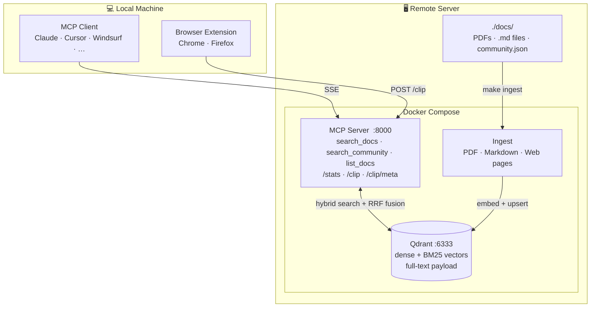

# Distill

**Turn your technical documentation into a knowledge base your AI can actually search.**

[](https://github.com/afly007/distill/actions/workflows/ci.yml)


---

## The problem

AI assistants are remarkably capable — until you ask about your specific environment. The firmware version you're running. The vendor feature that shipped six months after the training cutoff. The internal design doc your team wrote last quarter. The obscure CLI flag that's documented in a 900-page PDF nobody reads.

When an AI doesn't know something, it doesn't say "I don't know." It sounds confident anyway. That's the gap.

## What RAG does (and what Distill is)

RAG — Retrieval-Augmented Generation — is a technique where, instead of relying solely on what the AI learned during training, you give it a way to *look things up* at the moment you ask a question.

Think of it like distillation. You have raw source material: hundreds of PDFs, vendor guides, RFCs, internal wikis, community articles. Most of it is dense, repetitive, and hard to search. Distill processes that raw material — breaking it down, extracting the essence, and concentrating it into a form that can be retrieved precisely when needed.

When you ask your AI a question, Distill finds the relevant passages and hands them to the AI along with your question. The AI reasons over *your* documentation, not its training data. The answer is grounded. Citable. Current.

## Why an MCP server

MCP (Model Context Protocol) is the standard interface for connecting AI assistants to external tools and data sources. Distill runs as an MCP server, which means any MCP-compatible AI client — Claude, Cursor, Windsurf, and others — can call `search_docs()` automatically as part of answering your question. You don't copy-paste docs. You don't manage context windows. You just ask.

---

## How it works



Drop documents into `./docs/` → they are broken into sections and indexed → when you ask your AI a question, it searches the index first, finds the relevant sections, and answers using actual text from your documents, citing the source every time.

The indexing happens once (or automatically when you drop new files in). Search is instant.

---

## What you can search

Four source types, treated with different levels of trust:

| Type | Examples | Trust level |
|---|---|---|
| **Vendor documentation** | CLI references, config guides, release notes | Authoritative — use for exact syntax and configuration |
| **Validated designs** | CVDs, reference architectures, solution guides | High — vendor-recommended designs and best practices |
| **Internal notes** | Team runbooks, design decisions, internal guides | Trusted — your organisation's own knowledge |
| **Community references** | Curated blog posts, forum threads, web articles | Useful context — always verify against vendor docs before implementing |

Community sources are kept deliberately separate. Your AI won't mix them into standard search results — you have to explicitly ask for them, and every response comes with a reminder to verify before acting.

---

## Quick start

**You need:** Docker, an OpenAI API key, and an MCP-compatible AI client.

```bash
# 1. Clone and configure
cp .env.example .env
# Edit .env — add your OPENAI_API_KEY

# 2. Start the server
docker compose up -d

# 3. Drop your PDFs into ./docs/ then ingest
make ingest
```

**Connect your AI client — add to its MCP config:**

*Claude Code (`~/.claude/settings.json`):*
```json
{
  "mcpServers": {
    "distill": {
      "type": "sse",
      "url": "http://YOUR_SERVER_IP:8000/sse"
    }
  }
}
```

*Claude Desktop (`~/Library/Application Support/Claude/claude_desktop_config.json`):*
```json
{
  "mcpServers": {
    "distill": {
      "command": "npx",
      "args": ["-y", "mcp-remote", "http://YOUR_SERVER_IP:8000/sse", "--allow-http"]
    }
  }
}
```

That's it. Your AI can now search your documents.

---

## Adding documents

### Vendor PDFs

Drop them into `./docs/` and run:

```bash
make ingest
```

Progress is shown per file:

```
────────────────────────────────────────────────────────────
File:  cisco-ios-xe-17.pdf  (42.3 MB)
Pages: 1847 total, 1831 with text
Chunks: 4209  (43 embedding batches)
Done:  4209 chunks stored in 23.1s
```

To help your AI filter by vendor, product, or version, add a small metadata file next to each PDF. You can write it manually or generate it automatically:

```bash
make gen-sidecars   # scans each PDF with GPT-4o-mini and writes a draft .json
```

Review and edit the generated files before re-ingesting. They look like this:

```json
{
  "vendor":   "cisco",
  "product":  "ios-xe",
  "version":  "17.9.1",
  "doc_type": "cli-reference"
}
```

`gen-sidecars` also automatically detects validated design guides (CVDs, VSDs, reference architectures) and tags them accordingly. See [Metadata reference](#metadata-reference) for the full format.

Ingestion is idempotent — re-running on the same file is safe.

### Internal Markdown notes

Your team's runbooks, design decisions, and internal guides are valuable context. Drop `.md` files into `./docs/` (in any subfolder) and run `make ingest`. They are chunked by heading boundaries, falling back to fixed-stride for files without headings.

Add a sidecar to tag them as internal:

```json
{
  "doc_type":    "design-guide",
  "source_type": "internal"
}
```

### Curated web pages

For blog posts or forum threads you've found genuinely useful, create a manifest file:

```json
[
  {
    "url": "https://example.com/ospf-tuning-tips",
    "vendor": "aruba",
    "product": "aos-cx",
    "last_updated": "2024-06-01"
  }
]
```

```bash
make ingest-web ARGS="/docs/community.json"
```

These are stored as community-tier content and only surface when you explicitly ask for them.

### Browser extension (one-click save from any webpage)

The clipper extension lets you save any page you're reading directly to your Distill server — no manifest files, no copy-pasting URLs.

**Setup:**

1. Add `CLIP_API_KEY` to your `.env` (generate one with `openssl rand -hex 32`) and restart the server: `make restart`
2. In Chrome/Edge, go to `chrome://extensions`, enable **Developer mode**, click **Load unpacked**, and select the `browser-extension/` folder
3. Click the extension icon, open **⚙ Settings**, enter your server URL and API key, click **Test connection**

Firefox: go to `about:debugging#/runtime/this-firefox` → **Load Temporary Add-on** → select `browser-extension/manifest.json`.

**Using it:**

Browse to any page you want to save, click the extension icon, optionally tag it with a vendor and product (the dropdowns are pre-populated from your collection), and click **Save to Distill**. The page is fetched server-side, chunked, embedded, and stored as community-tier content in seconds. A green confirmation shows the chunk count when done.

Reddit links are automatically redirected to `old.reddit.com` for better text extraction — a blue notice in the popup confirms the rewrite.

Saved pages are immediately searchable via `search_community()`. They won't appear in `search_docs()` results (community content is always opt-in).

### Auto-ingest watch

To ingest new files automatically as you drop them in:

```bash
make watch        # starts background watcher — polls ./docs/ every 30s
make watch-stop   # stop it
```

---

## Talking to your AI

Any MCP-compatible assistant uses the search tool automatically when it recognises that your question is about your documentation. A few phrases that reliably trigger it (shown here with Claude as an example):

- *"Search the docs for…"*
- *"According to the AOS-CX documentation, how do I…"*
- *"Using the docs, what's the correct syntax for…"*
- *"Check the Juniper config guide for…"*

**What works well:**
- CLI syntax questions — *"What's the command to configure LACP on AOS-CX?"*
- Configuration examples — *"Show me how to set up OSPF area types on IOS-XE"*
- Design tradeoffs — *"What does the validated design recommend for core redundancy?"*
- Version-specific questions — *"Is this BGP syntax valid in JunOS 23.2?"*

**What doesn't work:**
- Asking about topics not in your documents — the AI will say nothing relevant was found rather than guessing
- Very short or ambiguous queries — give it enough to search with

### Sample conversation

```
You:    Search the docs for how to configure BGP route reflectors on IOS-XE

AI:     [calls search_docs("BGP route reflector configuration", vendor="cisco", product="ios-xe")]

        [1] cisco-ios-xe-17-cli.pdf  |  page 847  |  §BGP Route Reflector  |  [VENDOR-DOC tier-1]

        To configure a route reflector:

          router bgp 65000
           bgp cluster-id 1
           neighbor 10.0.0.2 remote-as 65000
           neighbor 10.0.0.2 route-reflector-client

        The cluster-id is optional when there is only one route reflector in the cluster...
```

### Asking for community references

Community sources are opt-in. Ask for them explicitly and the AI will always flag them as unverified:

```
You:    Are there any community notes on AOS-CX OSPF tuning?

AI:     [calls search_community("AOS-CX OSPF tuning", product="aos-cx")]

        COMMUNITY SOURCES — tier 4. Results from curated community content.
        Verify against vendor documentation before implementing in production.

        [1] score 0.412  |  vendor=aruba  |  product=aos-cx
            URL: https://example.com/ospf-tuning-tips
            ...
```

---

## What documents do I have?

Ask your AI directly or check the live dashboard:

```
You:    What documentation do you have access to?

AI:     [calls list_docs()]

        Collection: distill  |  Documents: 14  |  Chunks: 52,108

        Document                            Vendor  Product  Version  Doc Type          Tier
        ─────────────────────────────────────────────────────────────────────────────────────
        cisco-ios-xe-17-cli.pdf             cisco   ios-xe   17.9.1   cli-reference     1
        aruba-vsd-campus-10.13.pdf          hpe     aos-cx   10.13    validated-design  2
        se-team/bgp-design-notes.md         —       —        —        design-guide      3

        Tier 4 (community) content is excluded — use search_community() to query it.
```

Open `http://YOUR_SERVER_IP:8000/stats` for a live dashboard showing ingested documents, recent queries, coverage gaps, and latency.

---

## Upgrading an existing collection

If you have documents ingested before trust tiers were introduced, run this once to tag them all as vendor documentation:

```bash
make backfill-tiers
```

No re-ingestion needed — it updates existing records in place.

---

# Reference

---

## Environment variables

```bash
cp .env.example .env
```

| Variable | Default | Description |
|---|---|---|
| `OPENAI_API_KEY` | — | Required |
| `COLLECTION_NAME` | `distill` | Qdrant collection name — change to namespace multiple doc sets |
| `IMAGE_BASE` | `ghcr.io/afly007/distill` | GHCR registry prefix — required for `docker compose pull` |
| `RERANKER` | _(off)_ | `local` or `cohere` — improves result precision, see below |
| `COHERE_API_KEY` | — | Required when `RERANKER=cohere` |
| `TIER_BOOST_4` | `0.75` | Score penalty for community results (1.0 = disabled) |
| `CLIP_API_KEY` | — | Secret key for the browser extension `/clip` endpoint — set to enable |

### Enabling re-ranking (optional)

Re-ranking improves precision by running a cross-encoder over the top 20 retrieved chunks before returning the top 5. Set in `.env` and restart:

```bash
RERANKER=local    # CPU cross-encoder via flashrank — ~22 MB model, downloaded once on first start
RERANKER=cohere   # Cohere Rerank API — requires COHERE_API_KEY
```

```bash
docker compose up -d mcp-server
```

---

## Connecting your AI client

### Claude Code (CLI)

Add to `~/.claude/settings.json`:

```json
{
  "mcpServers": {
    "distill": {
      "type": "sse",
      "url": "http://YOUR_SERVER_IP:8000/sse"
    }
  }
}
```

### Claude Desktop

The desktop app needs a small bridge. Install Node.js first, then add to `~/Library/Application Support/Claude/claude_desktop_config.json`:

```json
{
  "mcpServers": {
    "distill": {
      "command": "npx",
      "args": ["-y", "mcp-remote", "http://YOUR_SERVER_IP:8000/sse", "--allow-http"]
    }
  }
}
```

The `--allow-http` flag is required for non-localhost URLs. Restart the app after saving.

### Other MCP clients (Cursor, Windsurf, etc.)

Any client that supports MCP SSE transports can connect. Point it at `http://YOUR_SERVER_IP:8000/sse`. Refer to your client's MCP configuration documentation for the exact format.

### SSH tunnel (if port 8000 is not publicly exposed)

```bash
ssh -L 8000:localhost:8000 user@your-server
```

Then use `http://localhost:8000/sse` in any config above, and omit `--allow-http` for the desktop app.

---

## Day-to-day operations

```bash
make up              # start Qdrant and MCP server
make down            # stop everything
make restart         # rebuild and restart MCP server after code changes
make logs            # tail MCP server logs
make build           # build both images locally

make ingest          # ingest new PDFs and Markdown files (skips already-ingested)
make ingest-force    # re-ingest everything (use after editing sidecars)
make ingest-web      # ingest web pages from a manifest  ARGS="/docs/community.json"
make backfill-tiers  # tag existing chunks with trust_tier=1 (run once after upgrading)
make watch           # auto-ingest new files dropped into ./docs/ every 30s
make watch-stop      # stop the watch container

make gen-sidecars    # auto-generate metadata sidecars for PDFs
make stats           # open stats page in browser (macOS)
```

Pass extra args via `ARGS`:

```bash
make ingest ARGS="/docs/cisco-ios-xe-17.pdf"
make ingest-force ARGS="/docs/cisco-ios-xe-17.pdf"
make gen-sidecars ARGS="--force"   # overwrite existing sidecars
```

### View live logs

```bash
docker compose logs -f mcp-server
docker compose logs -f qdrant
```

### Query the log database directly

```bash
docker run --rm -v distill_mcp_data:/data alpine \
  sh -c "apk add -q sqlite && sqlite3 /data/queries.db \
  'SELECT ts, query, top_score, top_source, top_source_type FROM queries ORDER BY id DESC LIMIT 20'"
```

### Delete and re-ingest a collection

```bash
curl -X DELETE http://localhost:6333/collections/distill
make ingest-force
```

### Check Qdrant collection info

```bash
curl http://localhost:6333/collections/distill
```

---

## Managing multiple document sets

Set `COLLECTION_NAME` to separate doc sets into named collections:

```bash
COLLECTION_NAME=networking   docker compose --profile ingest run --rm ingest
COLLECTION_NAME=cloud        docker compose --profile ingest run --rm ingest
```

The MCP server searches whichever collection it was started with. To switch, update `.env` and restart:

```bash
docker compose up -d mcp-server
```

---

## Stats dashboard

Open `http://YOUR_SERVER_IP:8000/stats` in a browser. Auto-refreshes every 60 seconds.

| Section | What it shows |
|---|---|
| Document Catalog | All ingested documents with vendor, product, version, doc type, trust tier, page and chunk counts |
| Recent Queries | Last 30 queries — time, text, filters, score, source, latency |
| Coverage Gaps | Queries scoring below threshold — topics likely missing from your corpus |
| Most Referenced Sources | Which documents get retrieved most, with average relevance score |
| Slowest Queries | Top 10 by latency — useful for spotting embedding API bottlenecks |

Every query is persisted to `/data/queries.db` (SQLite, WAL mode) inside the `mcp_data` Docker volume and survives container restarts.

---

## Metadata reference

Every chunk carries two trust fields set from the sidecar `.json` file:

| `trust_tier` | `source_type` | Searchable via | Description |
|---|---|---|---|
| 1 | `vendor-doc` | `search_docs()` | Standard vendor CLI refs, config guides, release notes |
| 2 | `validated-design` | `search_docs()` | CVDs, VSDs, reference architectures |
| 3 | `internal` | `search_docs()` | Internal team docs and runbooks |
| 4 | `community` | `search_community()` only | Curated web content — always prepends caveat |

Full sidecar format (all fields optional):

```json
{
  "vendor":      "cisco",
  "product":     "ios-xe",
  "version":     "17.9.1",
  "doc_type":    "cli-reference",
  "trust_tier":  1,
  "source_type": "vendor-doc"
}
```

Common `doc_type` values: `cli-reference`, `config-guide`, `design-guide`, `validated-design`, `release-notes`, `white-paper`

Documents without sidecars are still ingested and searchable — metadata is just not available for filtering. Add sidecars and re-run `make ingest-force` to backfill.

---

## CI/CD

| Workflow | Trigger | What it does |
|---|---|---|
| CI | Every PR + push to `main` | ruff lint + format check, Docker build (no push) |
| Release | Push to `main` or `v*` tags | Builds and pushes images to GHCR, auto-deploys to server |

**GHCR images** (public — no login required):

```
ghcr.io/afly007/distill/mcp-server:latest
ghcr.io/afly007/distill/mcp-server:v1.5.0
ghcr.io/afly007/distill/ingest:latest
```

Merges to `main` auto-deploy via the self-hosted GitHub Actions runner on the server. Manual fallback:

```bash
cd ~/distill
docker compose pull mcp-server
docker compose up -d mcp-server
```

---

## Development

**Prerequisites:** Python 3.12+, [pipx](https://pipx.pypa.io/), Docker

```bash
# Install pre-commit hooks (runs ruff on every commit)
make pre-commit-install   # requires: sudo apt install pipx && pipx ensurepath
```

All changes go through pull requests — direct pushes to `main` are blocked.

```bash
git checkout -b feat/your-feature
# make changes
ruff check --fix . && ruff format .   # fix lint before committing
git add <files> && git commit -m "feat: description"
git push -u origin feat/your-feature
gh pr create --title "..." --body "..."
gh pr checks <number> --watch
gh pr merge <number> --squash --delete-branch
```

ruff is configured in `pyproject.toml` (`line-length=100`, Python 3.12, rules E/F/W/I/UP).

---

## Switching to local embeddings

To eliminate OpenAI API costs, swap `text-embedding-3-small` for a local model (e.g. `nomic-embed-text` via Ollama). The embedding dimension changes from 1536 to 768, so the existing Qdrant collection must be deleted and re-created before re-ingesting. Update `EMBEDDING_MODEL` and `EMBEDDING_DIM` in both `ingest/ingest.py` and `mcp-server/server.py`.

---

## Security

Distill is designed for self-hosted, private network deployment. The current security model treats **network isolation as the primary perimeter** — the server is not intended to be internet-facing.

### Current state

**Protected:**
- `/clip` and `/clip/meta` require a `Bearer CLIP_API_KEY` header — the browser extension is the only authenticated endpoint
- Qdrant write access is only possible via the `mcp-server` container; the Qdrant port is not reachable from outside the host without LAN access
- The query log (SQLite) lives inside a Docker volume and is not directly accessible

**Not yet protected (known gaps, tracked as GitHub issues):**

| Gap | Risk | Issue |
|---|---|---|
| MCP SSE endpoint (`/sse`) is unauthenticated | Any LAN host can call all MCP tools | [#56](https://github.com/afly007/distill/issues/56) |
| `/stats` page is unauthenticated | Exposes document catalog and full query history | [#57](https://github.com/afly007/distill/issues/57) |
| Qdrant port 6333 bound to host | Any LAN host can read, write, or delete the collection directly | [#58](https://github.com/afly007/distill/issues/58) |
| `/clip` fetches any URL without SSRF protection | Can be used to probe internal services | [#59](https://github.com/afly007/distill/issues/59) |
| No rate limiting on `/clip` | Bulk requests can exhaust OpenAI API credits | [#60](https://github.com/afly007/distill/issues/60) |
| All traffic is plaintext HTTP (without Caddy) | API keys and queries travel unencrypted when TLS proxy is not enabled | [#61](https://github.com/afly007/distill/issues/61) |
| Browser extension `host_permissions` is `["http://*/*", "https://*/*"]` | Broader than necessary | [#62](https://github.com/afly007/distill/issues/62) |
| CORS on `/clip` allows all origins | Any page can trigger clip requests if the key is known | [#63](https://github.com/afly007/distill/issues/63) |

### Intended future state

The target posture for a hardened deployment:

- **MCP and stats authentication** — Bearer token on `/sse` and `/stats`, configured via `.env`
- **Qdrant port unexposed** — bind to `127.0.0.1` only; all Qdrant access via the mcp-server container
- **SSRF protection** — block private IP ranges and loopback in `_clip_fetch()` before making outbound requests
- **Rate limiting** — per-IP request cap on `/clip` to prevent API credit exhaustion
- **TLS** ✅ — Caddy reverse proxy included (`COMPOSE_PROFILES=tls`). Supports internal CA and Let's Encrypt DNS challenge. See [CONFIGURATION.md](CONFIGURATION.md#tls-setup).
- **Narrowed CORS** — restrict `/clip` to the server's own origin rather than `*`
- **Narrowed extension permissions** — scope `host_permissions` to only the configured server URL

For deployments outside a trusted private network, enabling TLS (see [CONFIGURATION.md](CONFIGURATION.md#tls-setup)) and addressing the remaining authentication gaps is strongly recommended before exposing the server to additional users.

---

*Built with AI assistance using [Claude Code](https://claude.ai/code). Architecture, code, and documentation developed collaboratively.*
