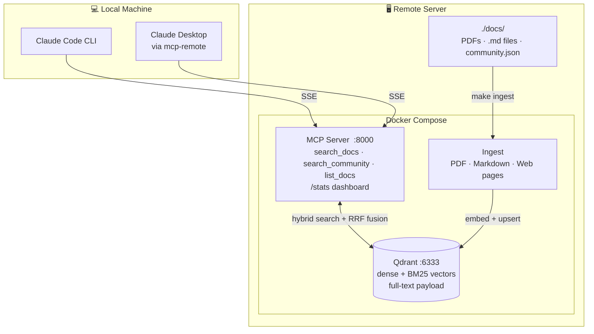

# Network Docs RAG

Give Claude a private library of your vendor documentation — so when you ask it how to configure OSPF on AOS-CX or what the correct BGP community syntax is for IOS-XE 17.9, it answers from *your actual manuals*, not from general training data.

---

## Why does this matter?

Claude is a capable assistant, but it has two limitations when it comes to vendor networking documentation:

1. **It may be out of date.** Training has a knowledge cutoff, so it may not know the exact syntax for the firmware version you're running.
2. **It can guess.** When Claude doesn't know something precisely, it sometimes produces a confident-sounding but wrong answer — a real problem when you're configuring production equipment.

This project fixes both. You give it your PDFs (and Markdown notes, and curated web links), and from that point on Claude searches them before answering. Every response is grounded in a specific chunk of a specific document, with a source reference you can open yourself.

Think of it like giving a knowledgeable colleague a stack of manuals and saying: *"only answer from what's in here."*

---

## How it works



You drop documents into `./docs/` → they are broken into sections and indexed → when you ask Claude a question, it searches the index first, finds the relevant sections, and answers using the actual text from your documents, citing the source and page number every time.

The indexing happens once (or automatically when you drop new files in). Search is instant.

---

## What you can search

There are four types of sources, treated with different levels of trust:

| Type | Examples | Trust level |
|---|---|---|
| **Vendor documentation** | Cisco CLI reference, Juniper config guide, Arista EOS docs | Authoritative — use for CLI syntax and configuration |
| **Validated designs** | HPE Aruba Validated Solution Guides, Cisco CVDs, reference architectures | High — vendor-recommended designs and best practices |
| **Internal notes** | Your team's Markdown runbooks, design notes, internal guides | Trusted — your own organisation's knowledge |
| **Community references** | Curated blog posts, forum threads, web articles | Useful context — always verify against vendor docs before implementing |

Community sources are kept deliberately separate. Claude won't mix them into standard search results — you have to explicitly ask for them, and every response comes with a reminder to verify before acting.

---

## Quick start

**You need:** Docker, an OpenAI API key, and Claude Code or Claude Desktop.

```bash
# 1. Clone and configure
cp .env.example .env
# Edit .env — add your OPENAI_API_KEY

# 2. Start the server
docker compose up -d

# 3. Drop your PDFs into ./docs/ then ingest
make ingest

# 4. Connect Claude — add to ~/.claude/settings.json
{
  "mcpServers": {
    "network-docs": {
      "type": "sse",
      "url": "http://YOUR_SERVER_IP:8000/sse"
    }
  }
}
```

That's it. Claude can now search your documents.

---

## Adding documents

### Vendor PDFs

Drop them into `./docs/` and run:

```bash
make ingest
```

Progress is shown per file:

```
────────────────────────────────────────────────────────────
File:  cisco-ios-xe-17.pdf  (42.3 MB)
Pages: 1847 total, 1831 with text
Chunks: 4209  (43 embedding batches)
Done:  4209 chunks stored in 23.1s
```

To help Claude filter by vendor, product, or version, add a small metadata file next to each PDF. You can write it manually or generate it automatically:

```bash
make gen-sidecars   # scans each PDF with GPT-4o-mini and writes a draft .json
```

Review and edit the generated files before re-ingesting. They look like this:

```json
{
  "vendor":   "cisco",
  "product":  "ios-xe",
  "version":  "17.9.1",
  "doc_type": "cli-reference"
}
```

`gen-sidecars` also automatically detects validated design guides (CVDs, VSDs, reference architectures) and tags them accordingly. See [Metadata reference](#metadata-reference) for the full format.

Ingestion is idempotent — re-running on the same file is safe.

### Internal Markdown notes

Your team's runbooks, design decisions, and internal guides are valuable context. Drop `.md` files into `./docs/` (in any subfolder) and run `make ingest`. They are chunked by heading boundaries, falling back to fixed-stride for files without headings.

Add a sidecar to tag them as internal:

```json
{
  "doc_type":    "design-guide",
  "source_type": "internal"
}
```

### Curated web pages

For blog posts or forum threads you've found genuinely useful, create a manifest file:

```json
[
  {
    "url": "https://example.com/ospf-tuning-tips",
    "vendor": "aruba",
    "product": "aos-cx",
    "last_updated": "2024-06-01"
  }
]
```

```bash
make ingest-web ARGS="/docs/community.json"
```

These are stored as community-tier content and only surface when you explicitly ask for them.

### Browser extension (one-click save from any webpage)

The clipper extension lets you save any page you're reading directly to your RAG server — no manifest files, no copy-pasting URLs.

**Setup:**

1. Add `CLIP_API_KEY` to your `.env` (generate one with `openssl rand -hex 32`) and restart the server: `make restart`
2. In Chrome/Edge, go to `chrome://extensions`, enable **Developer mode**, click **Load unpacked**, and select the `browser-extension/` folder
3. Click the extension icon, open **⚙ Settings**, enter your server URL and API key, click **Test connection**

**Using it:**

Browse to any page you want to save — a blog post, forum thread, or vendor article — click the extension icon, optionally tag it with a vendor and product, and click **Save to Network Docs**. The page is fetched, chunked, embedded, and stored as community-tier content in seconds. A green confirmation shows the chunk count when done.

Saved pages are immediately searchable via `search_community()`. They won't appear in `search_docs()` results (community content is always opt-in).

### Auto-ingest watch

To ingest new files automatically as you drop them in:

```bash
make watch        # starts background watcher — polls ./docs/ every 30s
make watch-stop   # stop it
```

---

## Talking to Claude effectively

Claude uses the search tool when it recognises that your question is about your documentation. A few phrases that reliably trigger it:

- *"Search my network docs for…"*
- *"According to the AOS-CX documentation, how do I…"*
- *"Using the docs, what's the correct syntax for…"*
- *"Check the Juniper config guide for…"*

**What works well:**
- CLI syntax questions — *"What's the command to configure LACP on AOS-CX?"*
- Configuration examples — *"Show me how to set up OSPF area types on IOS-XE"*
- Design tradeoffs — *"What does the Aruba validated design recommend for campus core redundancy?"*
- Version-specific questions — *"Is this BGP syntax valid in JunOS 23.2?"*

**What doesn't work:**
- Asking about topics not in your documents — Claude will say nothing relevant was found rather than guessing
- Very short or ambiguous queries — give Claude enough to search with

### Sample conversation

```
You:    Search my network docs for how to configure BGP route reflectors on IOS-XE

Claude: [calls search_docs("BGP route reflector configuration", vendor="cisco", product="ios-xe")]

        [1] cisco-ios-xe-17-cli.pdf  |  page 847  |  §BGP Route Reflector  |  [VENDOR-DOC tier-1]

        To configure a route reflector:

          router bgp 65000
           bgp cluster-id 1
           neighbor 10.0.0.2 remote-as 65000
           neighbor 10.0.0.2 route-reflector-client

        The cluster-id is optional when there is only one route reflector in the cluster...
```

### Asking for community references

Community sources are opt-in. Ask for them explicitly and Claude will always flag them as unverified:

```
You:    Are there any community notes on AOS-CX OSPF tuning?

Claude: [calls search_community("AOS-CX OSPF tuning", product="aos-cx")]

        COMMUNITY SOURCES — tier 4. Results from curated community content.
        Verify against vendor documentation before implementing in production.

        [1] score 0.412  |  vendor=aruba  |  product=aos-cx
            URL: https://example.com/ospf-tuning-tips
            ...
```

---

## What documents do I have?

Ask Claude directly or check the live dashboard:

```
You:    What documentation do you have access to?

Claude: [calls list_docs()]

        Collection: network_docs  |  Documents: 14  |  Chunks: 52,108

        Document                            Vendor  Product  Version  Doc Type          Tier
        ─────────────────────────────────────────────────────────────────────────────────────
        cisco-ios-xe-17-cli.pdf             cisco   ios-xe   17.9.1   cli-reference     1
        aruba-vsd-campus-10.13.pdf          hpe     aos-cx   10.13    validated-design  2
        se-team/bgp-design-notes.md         —       —        —        design-guide      3

        Tier 4 (community) content is excluded — use search_community() to query it.
```

Open `http://YOUR_SERVER_IP:8000/stats` for a live dashboard showing ingested documents, recent queries, coverage gaps (topics where your library has nothing relevant), and latency.

---

## Upgrading an existing collection

If you have documents ingested before trust tiers were introduced, run this once to tag them all as vendor documentation:

```bash
make backfill-tiers
```

No re-ingestion needed — it updates existing records in place.

---

---

# Reference

---

## Environment variables

```bash
cp .env.example .env
```

| Variable | Default | Description |
|---|---|---|
| `OPENAI_API_KEY` | — | Required |
| `COLLECTION_NAME` | `network_docs` | Qdrant collection name — change to namespace multiple doc sets |
| `IMAGE_BASE` | `ghcr.io/afly007/rag-docs` | GHCR registry prefix — required for `docker compose pull` |
| `RERANKER` | _(off)_ | `local` or `cohere` — improves result precision, see below |
| `COHERE_API_KEY` | — | Required when `RERANKER=cohere` |
| `TIER_BOOST_4` | `0.75` | Score penalty for community results (1.0 = disabled) |
| `CLIP_API_KEY` | — | Secret key for the browser extension `/clip` endpoint — set to enable |

### Enabling re-ranking (optional)

Re-ranking improves precision by running a cross-encoder over the top 20 retrieved chunks before returning the top 5. Set in `.env` and restart:

```bash
RERANKER=local    # CPU cross-encoder via flashrank — ~22 MB model, downloaded once on first start
RERANKER=cohere   # Cohere Rerank API — requires COHERE_API_KEY
```

```bash
docker compose up -d mcp-server
```

---

## Connecting Claude

### Claude Code (CLI)

Add to `~/.claude/settings.json`:

```json
{
  "mcpServers": {
    "network-docs": {
      "type": "sse",
      "url": "http://YOUR_SERVER_IP:8000/sse"
    }
  }
}
```

### Claude Desktop

The desktop app needs a small bridge. Install Node.js first, then add to `~/Library/Application Support/Claude/claude_desktop_config.json`:

```json
{
  "mcpServers": {
    "network-docs": {
      "command": "npx",
      "args": ["-y", "mcp-remote", "http://YOUR_SERVER_IP:8000/sse", "--allow-http"]
    }
  }
}
```

The `--allow-http` flag is required for non-localhost URLs. Restart the app after saving.

### SSH tunnel (if port 8000 is not publicly exposed)

```bash
ssh -L 8000:localhost:8000 user@your-server
```

Then use `http://localhost:8000/sse` in either config above, and omit `--allow-http` for the desktop app.

---

## Day-to-day operations

```bash
make up              # start Qdrant and MCP server
make down            # stop everything
make restart         # rebuild and restart MCP server after code changes
make logs            # tail MCP server logs
make build           # build both images locally

make ingest          # ingest new PDFs and Markdown files (skips already-ingested)
make ingest-force    # re-ingest everything (use after editing sidecars)
make ingest-web      # ingest web pages from a manifest  ARGS="/docs/community.json"
make backfill-tiers  # tag existing chunks with trust_tier=1 (run once after upgrading)
make watch           # auto-ingest new files dropped into ./docs/ every 30s
make watch-stop      # stop the watch container

make gen-sidecars    # auto-generate metadata sidecars for PDFs
make stats           # open stats page in browser (macOS)
```

Pass extra args via `ARGS`:

```bash
make ingest ARGS="/docs/cisco-ios-xe-17.pdf"
make ingest-force ARGS="/docs/cisco-ios-xe-17.pdf"
make gen-sidecars ARGS="--force"   # overwrite existing sidecars
```

### View live logs

```bash
docker compose logs -f mcp-server
docker compose logs -f qdrant
```

### Query the log database directly

```bash
docker run --rm -v rag-docs_mcp_data:/data alpine \
  sh -c "apk add -q sqlite && sqlite3 /data/queries.db \
  'SELECT ts, query, top_score, top_source, top_source_type FROM queries ORDER BY id DESC LIMIT 20'"
```

### Delete and re-ingest a collection

```bash
curl -X DELETE http://localhost:6333/collections/network_docs
make ingest-force
```

### Check Qdrant collection info

```bash
curl http://localhost:6333/collections/network_docs
```

---

## Managing multiple document sets

Set `COLLECTION_NAME` to separate doc sets into named collections:

```bash
COLLECTION_NAME=cisco   docker compose --profile ingest run --rm ingest
COLLECTION_NAME=juniper docker compose --profile ingest run --rm ingest
```

The MCP server searches whichever collection it was started with. To switch, update `.env` and restart:

```bash
docker compose up -d mcp-server
```

---

## Stats dashboard

Open `http://YOUR_SERVER_IP:8000/stats` in a browser. Auto-refreshes every 60 seconds.

| Section | What it shows |
|---|---|
| Document Catalog | All ingested documents with vendor, product, version, doc type, trust tier, page and chunk counts |
| Recent Queries | Last 30 queries — time, text, filters, score, source, latency |
| Coverage Gaps | Queries scoring below threshold — topics likely missing from your corpus |
| Most Referenced Sources | Which documents get retrieved most, with average relevance score |
| Slowest Queries | Top 10 by latency — useful for spotting embedding API bottlenecks |

Every query is persisted to `/data/queries.db` (SQLite, WAL mode) inside the `mcp_data` Docker volume and survives container restarts.

---

## Metadata reference

Every chunk carries two trust fields set from the sidecar `.json` file:

| `trust_tier` | `source_type` | Searchable via | Description |
|---|---|---|---|
| 1 | `vendor-doc` | `search_docs()` | Standard vendor CLI refs, config guides, release notes |
| 2 | `validated-design` | `search_docs()` | CVDs, VSDs, reference architectures |
| 3 | `internal` | `search_docs()` | Internal team docs and runbooks |
| 4 | `community` | `search_community()` only | Curated web content — always prepends caveat |

Full sidecar format (all fields optional):

```json
{
  "vendor":      "cisco",
  "product":     "ios-xe",
  "version":     "17.9.1",
  "doc_type":    "cli-reference",
  "trust_tier":  1,
  "source_type": "vendor-doc"
}
```

Common `doc_type` values: `cli-reference`, `config-guide`, `design-guide`, `validated-design`, `release-notes`, `white-paper`

Documents without sidecars are still ingested and searchable — metadata is just not available for filtering. Add sidecars and re-run `make ingest-force` to backfill.

---

## CI/CD

| Workflow | Trigger | What it does |
|---|---|---|
| CI | Every PR + push to `main` | ruff lint + format check, Docker build (no push) |
| Release | Push to `main` or `v*` tags | Builds and pushes images to GHCR, auto-deploys to server |

**GHCR images** (public — no login required):

```
ghcr.io/afly007/rag-docs/mcp-server:latest
ghcr.io/afly007/rag-docs/mcp-server:v1.3.0
ghcr.io/afly007/rag-docs/ingest:latest
```

Merges to `main` auto-deploy via the self-hosted GitHub Actions runner on the server. Manual fallback:

```bash
cd ~/rag-docs
docker compose pull mcp-server
docker compose up -d mcp-server
```

---

## Development

**Prerequisites:** Python 3.12+, [pipx](https://pipx.pypa.io/), Docker

```bash
# Install pre-commit hooks (runs ruff on every commit)
make pre-commit-install   # requires: sudo apt install pipx && pipx ensurepath
```

All changes go through pull requests — direct pushes to `main` are blocked.

```bash
git checkout -b feat/your-feature
# make changes
ruff check --fix . && ruff format .   # fix lint before committing
git add <files> && git commit -m "feat: description"
git push -u origin feat/your-feature
gh pr create --title "..." --body "..."
gh pr checks <number> --watch
gh pr merge <number> --squash --delete-branch
```

ruff is configured in `pyproject.toml` (`line-length=100`, Python 3.12, rules E/F/W/I/UP).

---

## Switching to local embeddings

To eliminate OpenAI API costs, swap `text-embedding-3-small` for a local model (e.g. `nomic-embed-text` via Ollama). The embedding dimension changes from 1536 to 768, so the existing Qdrant collection must be deleted and re-created before re-ingesting. Update `EMBEDDING_MODEL` and `EMBEDDING_DIM` in both `ingest/ingest.py` and `mcp-server/server.py`.
