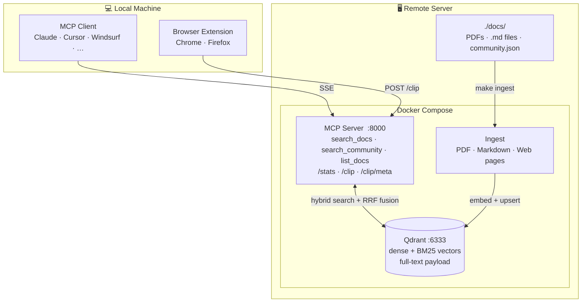

# Distill

**Turn your technical documentation into a knowledge base your AI can actually search.**

[](https://github.com/afly007/distill/actions/workflows/ci.yml)


---

## Contents

- [The problem](#the-problem)
- [What it does](#what-it-does)
- [Features](#features)
- [How it works](#how-it-works)
- [What you can search](#what-you-can-search)
- [Quick start](#quick-start)
- [Security](#security)
- [Documentation](#documentation)

---

## The problem

AI assistants are remarkably capable — until you ask about your specific environment. The firmware version you're running. The vendor feature that shipped six months after the training cutoff. The internal design doc your team wrote last quarter. The obscure CLI flag that's documented in a 900-page PDF nobody reads.

When an AI doesn't know something, it doesn't say "I don't know." It sounds confident anyway. That's the gap.

## What it does

Distill is a self-hosted RAG pipeline. You drop your PDFs, Markdown files, and curated web pages into a folder — Distill ingests them, builds a semantic search index, and exposes `search_docs()` as an MCP tool. Any MCP-compatible AI client calls it automatically when it recognises your question is about your documentation. The answer is grounded. Citable. Current.

MCP (Model Context Protocol) is the standard interface for connecting AI assistants to external tools and data sources. Claude Code, Claude Desktop, Cursor, and Windsurf all support it.

## Features

- **Hybrid search** — BM25 sparse + dense vector retrieval fused with Reciprocal Rank Fusion (RRF)
- **Section-aware chunking** — PDF table of contents drives split boundaries; stable chunk IDs across page reflows
- **Trust-tier content model** — vendor docs, validated designs, internal notes, and community references are kept separate and retrieved with independent controls
- **Re-ranking** — optional cross-encoder pass over the top 20 candidates (local flashrank or Cohere API)
- **Auto-metadata generation** — GPT-4o-mini classifies vendor, product, version, and doc type from the first 10 pages
- **Browser extension** — one-click save any web page to the community tier from Chrome or Firefox
- **File browser** — web UI for upload, metadata editing, and document management without SSH access
- **Stats dashboard** — live query log, coverage gaps, latency tracking, and top sources
- **Watch mode** — background watcher ingests new files as you drop them in
- **TLS reverse proxy** — optional Caddy proxy with security hardening (HTTPS, response headers, rate limiting, basic auth)
- **MCP server** — SSE transport; works with Claude Code (native SSE), Claude Desktop (via mcp-remote), Cursor, Windsurf

---

## How it works



Drop documents into `./docs/` → they are broken into sections and indexed → when you ask your AI a question, it searches the index first, finds the relevant sections, and answers using actual text from your documents, citing the source every time.

The indexing happens once (or automatically when you drop new files in). Search is instant.

---

## What you can search

Four source types, treated with different levels of trust:

| Type | Examples | Trust level |
|---|---|---|
| **Vendor documentation** | CLI references, config guides, release notes | Authoritative — use for exact syntax and configuration |
| **Validated designs** | CVDs, reference architectures, solution guides | High — vendor-recommended designs and best practices |
| **Internal notes** | Team runbooks, design decisions, internal guides | Trusted — your organisation's own knowledge |
| **Community references** | Curated blog posts, forum threads, web articles | Useful context — always verify against vendor docs before implementing |

Community sources are kept deliberately separate. Your AI won't mix them into standard search results — you have to explicitly ask for them, and every response comes with a reminder to verify before acting.

---

## Quick start

**You need:** Docker, an OpenAI API key, and an MCP-compatible AI client.

```bash
# 1. Clone and configure
cp .env.example .env
# Edit .env — add your OPENAI_API_KEY

# 2. Start the server
docker compose up -d

# 3. Drop your PDFs into ./docs/ then ingest
make ingest
```

**Connect your AI client — add to its MCP config:**

*Claude Code (`~/.claude/settings.json`):*
```json
{
  "mcpServers": {
    "distill": {
      "type": "sse",
      "url": "http://YOUR_SERVER_IP:8000/sse"
    }
  }
}
```

*Claude Desktop (`~/Library/Application Support/Claude/claude_desktop_config.json`):*
```json
{
  "mcpServers": {
    "distill": {
      "command": "npx",
      "args": ["-y", "mcp-remote", "http://YOUR_SERVER_IP:8000/sse", "--allow-http"]
    }
  }
}
```

That's it. Your AI can now search your documents. See [USAGE.md](USAGE.md) for adding documents, sample conversations, and day-to-day operations.

---

## Security

Distill is designed for self-hosted, private network deployment. The current security model treats **network isolation as the primary perimeter** — the server is not intended to be internet-facing.

### What is protected

**Always (core stack):**
- `/clip` and `/clip/meta` require a `Bearer CLIP_API_KEY` header — the browser extension is the only authenticated endpoint
- Qdrant write access is only possible via the `mcp-server` container; the Qdrant ports are bound to `127.0.0.1` only
- The query log (SQLite) lives inside a Docker volume and is not directly accessible

**When `COMPOSE_PROFILES=tls` (Caddy proxy):**
- All traffic is encrypted with TLS (Caddy internal CA or Let's Encrypt via DNS challenge)
- Security response headers on every response: `Strict-Transport-Security`, `X-Content-Type-Options: nosniff`, `X-Frame-Options: DENY`, `Referrer-Policy`, `Server` header removed
- Per-IP rate limiting on `/clip` (default 20 req/min) — protects OpenAI API credits
- Optional HTTP basic auth on `/stats` and `/files` — set `ADMIN_USER` + `ADMIN_PASSWORD_HASH` in `.env` to enable

### Known gaps (tracked as GitHub issues)

| Gap | Risk | Issue |
|---|---|---|
| MCP SSE endpoint (`/sse`) is unauthenticated | Any LAN host can call all MCP tools | [#56](https://github.com/afly007/distill/issues/56) |
| `/stats` and `/files` unauthenticated by default | Exposes document catalog and full query history without Caddy or without ADMIN_USER set | [#57](https://github.com/afly007/distill/issues/57) |
| `/clip` fetches any URL without SSRF protection | Can be used to probe internal services | [#59](https://github.com/afly007/distill/issues/59) |
| Browser extension `host_permissions` is `["http://*/*", "https://*/*"]` | Broader than necessary | [#62](https://github.com/afly007/distill/issues/62) |
| CORS on `/clip` allows all origins | Any page can trigger clip requests if the key is known | [#63](https://github.com/afly007/distill/issues/63) |

### Intended future state

- **MCP and stats authentication** — Bearer token on `/sse` and `/stats`, configured via `.env`
- **SSRF protection** — block private IP ranges and loopback in `_clip_fetch()` before making outbound requests
- **Narrowed CORS** — restrict `/clip` to the server's own origin rather than `*`
- **Narrowed extension permissions** — scope `host_permissions` to only the configured server URL

For deployments outside a trusted private network, enabling TLS (`COMPOSE_PROFILES=tls` — see [CONFIGURATION.md](CONFIGURATION.md#tls-setup)) and setting `ADMIN_USER` to protect the stats and file browser pages is strongly recommended.

---

## Documentation

| Document | Contents |
|---|---|
| **README.md** (this file) | Overview, features, architecture, quick start, security posture |
| **[USAGE.md](USAGE.md)** | Adding documents, searching, day-to-day operations, stats, metadata reference, development guide |
| **[CONFIGURATION.md](CONFIGURATION.md)** | All environment variables, TLS setup (internal CA and DNS challenge), MCP client configurations, sidecar format, operational commands |

---

*Built with AI assistance using [Claude Code](https://claude.ai/code). Architecture, code, and documentation developed collaboratively.*
